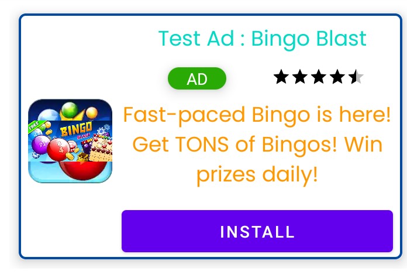

# Modern Admob
Modern Admob is a library which reduce your code up to 70% while implementing admob advanced native ads. It is super easy and cool. This library can implement your native admob banners with different designs and templets with few line of codes. Believe me! its super easy and understandable.
### Features:
- Fully customizable
- Builtin Templates (According to google guidelines)
- Add your own custom template




### Pre Steps:
Add this inside application tag in your AndroidManifest.xml file:
```
<meta-data
            android:name="com.google.android.gms.ads.APPLICATION_ID"
            android:value="your-key-goes-here"/>
```
Initialize Admob SDK in onCreate() method:
`MobileAds.initialize(this)`
### Step 1: Implement Library
#### 1.1
Add it in your root build.gradle or settings.gradle
```
 repositories {
        google()
        mavenCentral()
        maven { url 'https://jitpack.io' }
    }
```
#### 1.2
Add the dependency:
`implementation 'com.github.farimarwat:Modern-Admob:1.0'`

### Step 2: Include xml code
(Add/Remove properties according to your need)
```
<pk.farimarwat.modernadmob.AdmobView
    android:id="@+id/myads"
        android:layout_width="match_parent"
        android:layout_height="wrap_content"
        app:layout_constraintStart_toStartOf="parent"
        app:layout_constraintEnd_toEndOf="parent"
        app:layout_constraintTop_toTopOf="parent"
        android:layout_marginTop="16dp"
        android:layout_margin="8dp"
        app:av_HeadlineTextSize="18dp"
        app:av_HeadlineFontFamily="@font/poppins"
        app:av_HeadlineColor="@color/teal_200"
        app:av_backgroundBadge="@drawable/bg_badge"
        app:av_adtype="AD_TYPE_MEDIUM"
        app:av_backgroundBody="@drawable/bg_adbody"
        app:av_BodyTextColor="#FF9800"
        app:av_BodyTextFontFamily="@font/poppins"
        app:av_BodyTextSize="18dp"
        app:av_StarRatingColor="#000000"
        app:av_customTemplate="@layout/customtemplate"
        />
```
### Step 3: Manage code
(Activity Code)
```
class MainActivity : AppCompatActivity() {
    lateinit var binding: ActivityMainBinding
    override fun onCreate(savedInstanceState: Bundle?) {
        super.onCreate(savedInstanceState)
        binding = ActivityMainBinding.inflate(layoutInflater)
        setContentView(binding.root)
        MobileAds.initialize(this)
        binding.myads
            .loadAd(this,"Your-Ad-Id",
            object : AdmobView.ModernAdmobListener {
                override fun onAdClicked() {

                }

                override fun onAdClosed() {

                }

                override fun onAdFailedToLoad(error: LoadAdError) {
                    Log.e("TEST",error.message)
                }

                override fun onAdImpression() {
                    TODO("Not yet implemented")
                }

                override fun onAdLoaded() {
                    Log.e("TEST","Add Loaded")
                }

                override fun onAdOpened() {
                    TODO("Not yet implemented")
                }


            })
    }
}
```
### Built in Templates
There are two templates at moment. I will add more in next version
- Medium
- Small
Note: If you have made a custom template and want to share with the community then kindly send it at: farimarwat@gmail.com. I will add it with your name in next version.

### Custom Template
***Note: If you want to use your own template/layout for native ad then keep the ids according to this template otherwise it will not work. How ever you can change the layout as you wish. You can also remove views according to your need e.g. remove rating bar etc***

### Sample Custom Layout
- Create a layout file in layout folder
- For example custom.xml
- use the attribute below to load the template:
`app:av_customTemplate="@layout/customtemplate"`

```
<?xml version="1.0" encoding="utf-8"?>
<RelativeLayout xmlns:android="http://schemas.android.com/apk/res/android"
    android:layout_width="match_parent"
    android:layout_height="wrap_content"
    xmlns:app="http://schemas.android.com/apk/res-auto"
    >
    <com.google.android.gms.ads.nativead.NativeAdView
        android:id="@+id/nativead"
        android:layout_width="match_parent"
        android:layout_height="wrap_content">
        <androidx.constraintlayout.widget.ConstraintLayout
            android:layout_width="match_parent"
            android:layout_height="wrap_content"
            >
            <ImageView
                android:id="@+id/ad_app_icon"
                android:layout_width="40dp"
                android:layout_height="40dp"
                app:layout_constraintStart_toStartOf="parent"
                app:layout_constraintEnd_toEndOf="parent"
                app:layout_constraintTop_toTopOf="@+id/card_container_body"
                app:layout_constraintBottom_toTopOf="@+id/card_container_body"
                android:src="@drawable/icon"
                android:elevation="12dp"
                />
            <ImageView
                android:id="@+id/ad_logo"
                android:layout_width="40dp"
                android:layout_height="40dp"
                app:layout_constraintStart_toStartOf="parent"
                app:layout_constraintEnd_toEndOf="parent"
                app:layout_constraintTop_toTopOf="@+id/card_container_body"
                app:layout_constraintBottom_toTopOf="@+id/card_container_body"
                android:src="@drawable/icon"
                android:elevation="12dp"
                />
            <TextView
                android:id="@+id/txt_ad_badge"
                android:layout_width="wrap_content"
                android:layout_height="wrap_content"
                android:text="AD"
                android:textColor="#ffffff"
                android:paddingHorizontal="16dp"
                android:layout_margin="8dp"
                app:layout_constraintTop_toTopOf="@+id/card_container_body"
                app:layout_constraintStart_toStartOf="@+id/card_container_body"
                android:elevation="8dp"
                />
            <androidx.cardview.widget.CardView
                android:id="@+id/card_container_body"
                android:layout_width="match_parent"
                android:layout_height="wrap_content"
                app:layout_constraintBottom_toBottomOf="parent"
                app:layout_constraintEnd_toEndOf="parent"
                app:layout_constraintStart_toStartOf="parent"
                app:layout_constraintTop_toTopOf="parent"
                app:cardElevation="5dp"
                android:layout_marginTop="50dp"
                android:layout_marginBottom="8dp"
                >
                <LinearLayout
                    android:id="@+id/container_body"
                    android:layout_width="match_parent"
                    android:layout_height="wrap_content"
                    android:orientation="vertical"
                    android:paddingHorizontal="8dp"
                    android:paddingTop="32dp"
                    >
                    <LinearLayout
                        android:layout_width="match_parent"
                        android:layout_height="wrap_content"
                        android:orientation="horizontal">
                        <TextView
                            android:id="@+id/ad_headline"
                            android:layout_width="0dp"
                            android:layout_height="wrap_content"
                            android:layout_weight="1"
                            android:textStyle="bold"
                            android:textSize="@dimen/headlinetext"
                            android:gravity="center"
                            android:textColor="@color/colorprimarydark"
                            />
                        <RatingBar
                            android:id="@+id/ad_rating"
                            android:layout_width="wrap_content"
                            android:layout_height="wrap_content"
                            android:isIndicator="true"
                            android:numStars="5"
                            android:stepSize="0.5"
                            android:layout_gravity="center_vertical"
                            style="?android:attr/ratingBarStyleSmall"
                            />
                    </LinearLayout>
                    <TextView
                        android:id="@+id/ad_body"
                        android:layout_width="match_parent"
                        android:layout_height="wrap_content"
                        android:layout_marginTop="8dp"
                        android:gravity="center"
                        android:textColor="#000000"
                        android:textSize="16dp"
                        />
                    <LinearLayout
                        android:layout_width="match_parent"
                        android:layout_height="wrap_content"
                        android:orientation="horizontal">
                        <TextView
                            android:id="@+id/ad_advertiser"
                            android:layout_width="match_parent"
                            android:layout_height="wrap_content"
                            android:layout_weight="1"
                            android:layout_marginTop="8dp"
                            android:gravity="center"
                            android:textColor="@color/colorprimary"
                            android:textSize="16dp"
                            />
                        <TextView
                            android:id="@+id/ad_store"
                            android:layout_width="match_parent"
                            android:layout_height="wrap_content"
                            android:layout_weight="1"
                            android:layout_marginTop="8dp"
                            android:gravity="center"
                            android:textColor="@color/colorprimary"
                            android:textSize="16dp"
                            />
                        <TextView
                            android:id="@+id/ad_price"
                            android:layout_width="match_parent"
                            android:layout_height="wrap_content"
                            android:layout_weight="1"
                            android:layout_marginTop="8dp"
                            android:gravity="center"
                            android:textColor="@color/colorprimary"
                            android:textSize="16dp"
                            />
                    </LinearLayout>
                    <com.google.android.gms.ads.nativead.MediaView
                        android:id="@+id/ad_media"
                        android:layout_width="match_parent"
                        android:layout_height="150dp"
                        android:layout_gravity="center"
                        android:visibility="gone"
                        />
                    <ImageView
                        android:id="@+id/ad_image"
                        android:layout_width="match_parent"
                        android:layout_height="200dp"
                        android:layout_gravity="center"
                        android:adjustViewBounds="true"
                        android:visibility="gone"
                        />
                    <Button
                        android:id="@+id/ad_call_to_action"
                        android:layout_width="match_parent"
                        android:layout_height="wrap_content"
                        android:layout_margin="8dp"
                        />
                </LinearLayout>
            </androidx.cardview.widget.CardView>
        </androidx.constraintlayout.widget.ConstraintLayout>
    </com.google.android.gms.ads.nativead.NativeAdView>
</RelativeLayout>
```
**I have made this library in a very short and free time and I have not test it for bugs and issues. It is working on my device till now. I will also try my best to maintain it in future when ever i get free time. If you have any suggestions then feel free to contact with me**
**Linkedin Profile:  **
[Farman Ullah Khan](https://www.linkedin.com/in/farman-ullah-khan-a02859196/ "Farman Ullah Khan")
